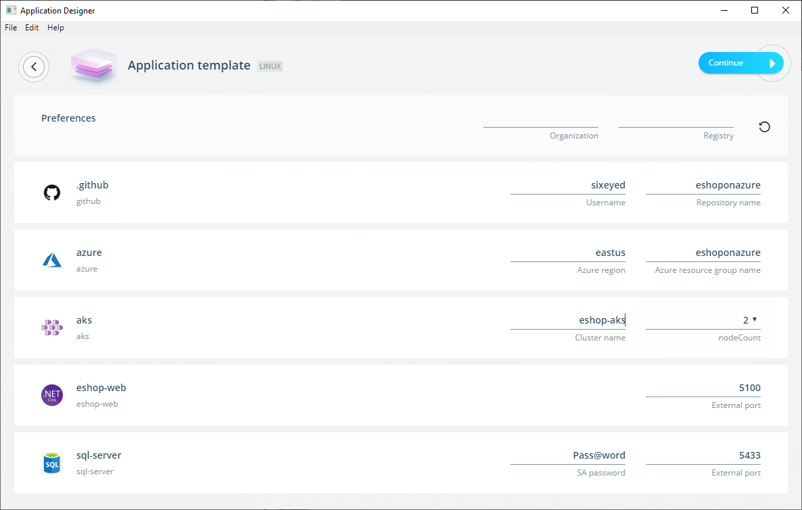
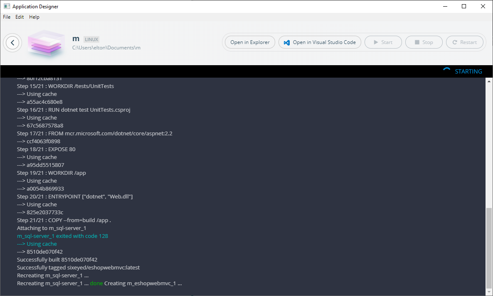

# eShop on Azure - the Workshop

In this workshop you'll learn how to deploy applications to Azure Kubernetes Service using Docker Application Templates and GitHub Actions.

This is what you'll be doing:

- create a GitHub repository to store your demo code and the credentials to deploy to Azure

- run a Docker Application Template which generates code and a CI/CD pipelie for the .NET Core demo app [eShopOnWeb](https://github.com/dotnet-architecture/eShopOnWeb)

- push your local code to GitHub which runs a workflow to create an Azure SQL database and an Azure Kubernetes Service cluster

- run the app locally in Docker containers to see how it works, and make some simple changes

- push the changed code to GitHub which runs a workflow to build Docker images, push them to Docker Hub, and deploy the app onto your AKS cluster.

It sounds like a lot, but it's really simple because the template generates documentation for you which guides you through all the steps.

## Pre-requisites

You'll need a few things before you start:

1. A version of [Docker Desktop](https://www.docker.com/products/docker-desktop) with [Application Templates](https://blog.docker.com/2019/07/application-templates-docker-desktop-enterprise/) enabled.

> The demo is a Linux app, so on Windows you need to use Linux container mode. That's the default so you only need to change it if you've switched to Windows container mode.

2. A [Docker Hub account](https://hub.docker.com/signup), so the pipeline can push the Docker images it builds, and the Kubernetes cluster can pull them.

3. Some tools to work with the source code - [Git](https://gitforwindows.org) and [Visual Studio Code](https://code.visualstudio.com). If you have [Chocolatey](https://chocolatey.org) set up you can install them with:

```
choco install -y git
choco install -y visualstudiocode
```

4. A Service Principal in Azure, which the pipline uses to manage resources when you deploy. You can use the [Azure CLI](https://github.com/Azure/azure-cli) or [Azure Cloud Shell](https://shell.azure.com) to run this command:

```
az ad sp create-for-rbac --name http://eshoponazure
```

> Make a note of the output, you'll need to add the details to GitHub

5. A GitHub repo. The pipeline runs using [GitHub Actions](https://help.github.com/en/articles/about-github-actions). Create an empty repo and set the following secrets (under _Settings...Secrets_):

- `AZURE_SP_APP_ID` - Service Principal application ID
- `AZURE_SP_NAME` - Service Principal name
- `AZURE_SP_PASSWORD` - Service Principal password
- `AZURE_SP_TENANT` - Service Principal tenant
- `AZURE_SQL_SERVER_NAME` - Name of the SQL Server instance (an existing one or a new one)
- `AZURE_SQL_PASSWORD` - Password for SQL Server (any valid SQL Authentication password)
- `DOCKER_HUB_USERNAME` - Docker Hub username
- `DOCKER_HUB_ACCESS_TOKEN` - Docker Hub [Personal Access Token](https://www.docker.com/blog/docker-hub-new-personal-access-tokens/)

## Setup

Update your App Template config in `~/.docker/application-template/preferences.yaml` to include the template library at `https://raw.githubusercontent.com/sixeyed/eshoponazure-workshop/master/eshopon-library.yaml`.

This example includes the local demo libraries and the main Docker library:

```
apiVersion: v1alpha1
disableFeedback: false
kind: Preferences
repositories:
- name: eshoponazure
  url: https://raw.githubusercontent.com/sixeyed/eshoponazure-workshop/master/eshop-library.yaml
- name: library
  url: https://docker-application-template.s3.amazonaws.com/production/v0.1.5/library.yaml
```

## Run the template

Right-click the Docker whale icon in your taskbar and select _Design new application..._ A window launches asking if you want to choose an existing template or design a custom app; select _Choose a template_.

> If you're running Docker Desktop on Windows you'll be asked if you want to run a Linux or Windows app - the template we'll be using is Linux so select _Linux_.

Now select the _eShop on Web_ template from the gallery:


From here you'll need to add some details about the deployment, which the template captures as parameters:



- _GitHub Username_ and _Repository name_ - use the repo you created earlier with all the secrets stored for Azure and Docker Hub

- _Azure resource group name_ - any name you like for the resource group to create

- _AKS Cluster name_ - any name for the cluster to create

The other parameters have default values, and you can leave them as they are or change them to suit your deployment.

> The SQL Server password is onyl used when you run the app locally, the Azure deployment uses the password you stored in the GitHub secret

Now click _Continue_, give your application a name and click _Scaffold_. Docker Desktop runs the template and generates the source code and GitHub workflows on you local machine.

When the scaffolding process finishes click _Run application_. That builds and runs the app in local containers. While it's building click _Open in Visual Studio Code_ to launch a VS Code instance with the generated application code:



## Head over to the new docs

Now you can follow the generated documentation from the source code. Browse to the README file in the `eshop-web` folder and contine from there.

Good luck :)
